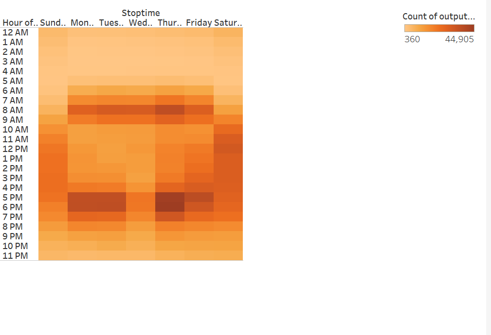
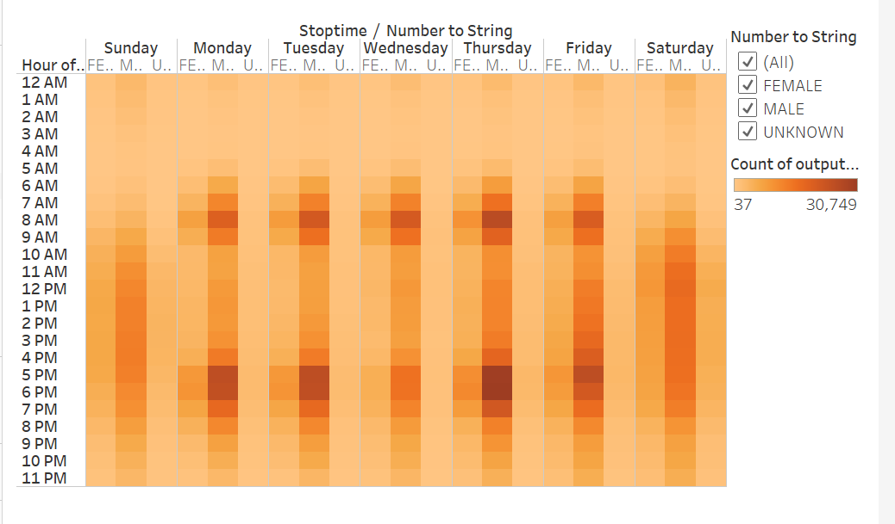
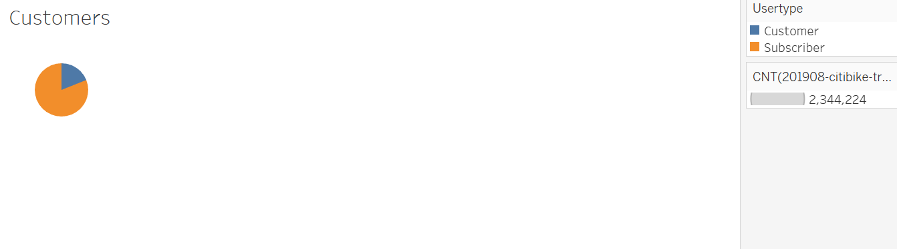
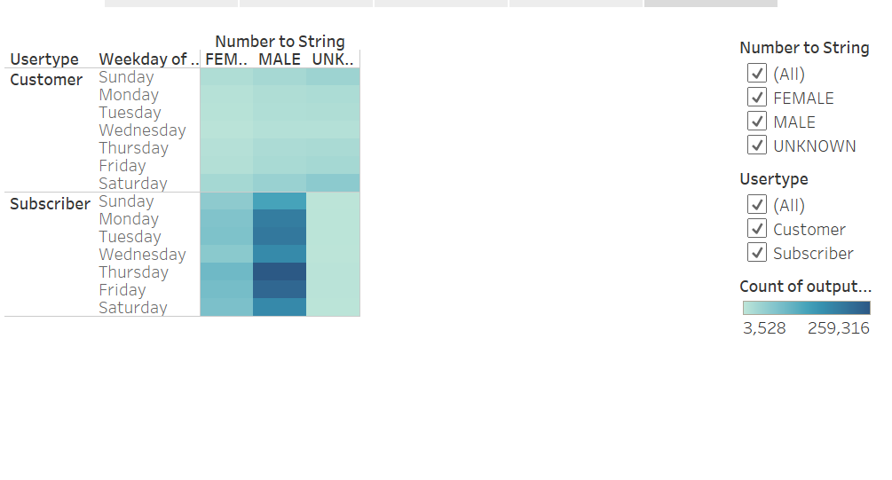
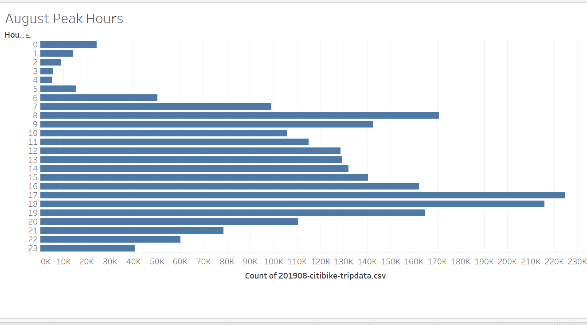

# Bikesharing

## overview
The purpose of this analysis was to show the length of time bikes were checked out per rider & gender, the number of bike trips per rider & gender per hour, and the number of bike trips per user & gender for each day of week.

## Results

The most popular trip duration was five hours.

Males had the most amount of trips, and exceeding five hours the longer the tripduration the less amount of rides.

The most popular stoptimes were during the week between 8-9am and 5-7pm.

Males had the most rides with the largest amount of stoptimes during the week between 8-9am and 5-7pm.

The largest amount of rides were by the subscriber usertype.

Males that were subscribers had the largest amount of rides. 

The peak hours in August were 8-9am and 5-7pm. 

## Summary
Males had the largest amount of rides, especially the subscribers. The most popular times for a ride seem to be during rush hour on the weekdays (8-9am or 5-7pm). An additional visualizations that could take place would be to look at the number of ride per hour for each user on the weekend. Another visualization could be to look at the number of rides each weekday based on the users birth date.
